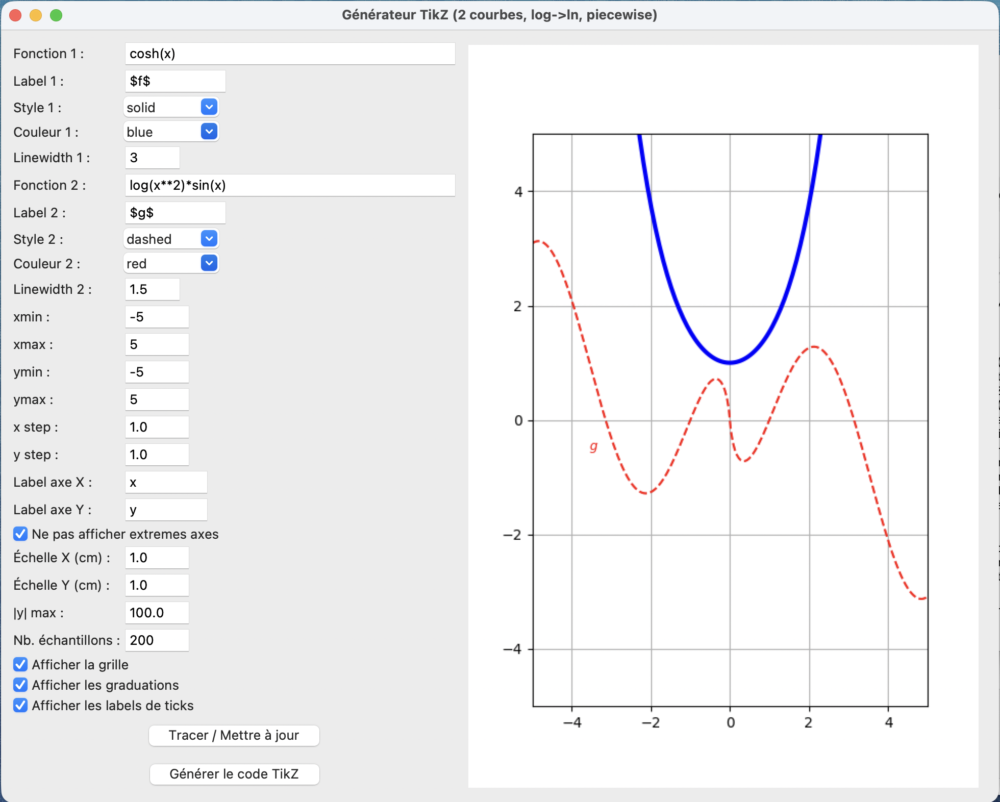
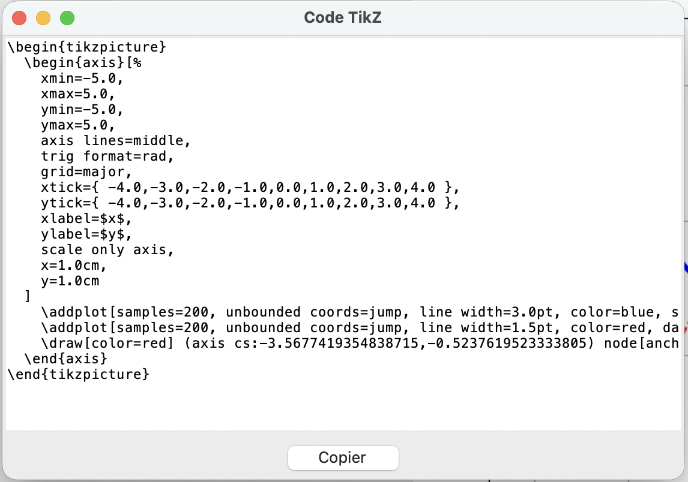

# MakeTikz

[](LICENSE)

## Français

Générateur interactif de code **TikZ/pgfplots** pour produire rapidement des figures mathématiques propres, avec une seconde application dédiée à l'**interpolation par points**.

### Aperçu

| Tracés symboliques (`plot_tikz_generator.py`) | Interpolation par points (`Lissage.py`) |
|:---:|:---:|
|  |  |

### Contenu

- `plot_tikz_generator.py` : générateur interactif de code TikZ/pgfplots
- `Lissage.py` : outil d'interpolation par points
- `Interface1.png`, `Interface2.png` : captures d'écran
- `LICENSE` : licence MIT

### Utilisation

Clonez le dépôt puis lancez le script Python souhaité selon votre usage.

```bash
git clone https://github.com/philipperackette/MakeTikz.git
cd MakeTikz
python plot_tikz_generator.py
```

ou :

```bash
python Lissage.py
```

### Public visé

- enseignants de mathématiques,
- étudiants,
- utilisateurs de LaTeX/TikZ souhaitant produire rapidement des graphiques exploitables.

---

## English

Interactive **TikZ/pgfplots** code generator for quickly producing clean mathematical figures, with a second application dedicated to **point interpolation**.

### Overview

| Symbolic plots (`plot_tikz_generator.py`) | Point interpolation (`Lissage.py`) |
|:---:|:---:|
|  |  |

### Contents

- `plot_tikz_generator.py`: interactive TikZ/pgfplots code generator
- `Lissage.py`: point interpolation tool
- `Interface1.png`, `Interface2.png`: screenshots
- `LICENSE`: MIT license

### Usage

Clone the repository, then run the Python script you need.

```bash
git clone https://github.com/philipperackette/MakeTikz.git
cd MakeTikz
python plot_tikz_generator.py
```

or:

```bash
python Lissage.py
```

### Intended audience

- mathematics teachers,
- students,
- LaTeX/TikZ users who want to generate reusable plots quickly.

---

## Licence / License

Ce projet est distribué sous licence [MIT](LICENSE).  
This project is distributed under the [MIT License](LICENSE).
